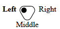
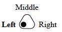
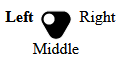
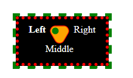
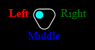

# ls-threeway-toggle
- [ls-threeway-toggle](#ls-threeway-toggle)
  - [Usage](#usage)
  - [&lt;three-way-toggle&gt; element](#three-way-toggle-element)
    - [Attributes](#attributes)
    - [Sub Elements](#sub-elements)
    - [Text content](#text-content)
    - [Technical summary](#technical-summary)
    - [Javascript API](#javascript-api)
      - [Constructor](#constructor)
      - [Properties](#properties)
      - [Methods](#methods)
  - [&lt;option&gt; Element](#option-element)
    - [Attributes](#attributes-1)
    - [Sub Elements](#sub-elements-1)
    - [Text content](#text-content-1)
    - [Technical summary](#technical-summary-1)
    - [Javascript API](#javascript-api-1)
  - [Styling with CSS](#styling-with-css)
    - [Examples](#examples)
  - [Javascript example](#javascript-example)
  - [Browser Compatibility](#browser-compatibility)

## Usage
1. Install the module with `npm install git+ssh://git@github.com:dj-djl/ls-threeway-toggle.git`
2. Add the script to your page:

    <script src="3way-toggle.mjs" type="module"></script>

3. Optionally add some style overrides:

    <style>
      three-way-toggle {
        --color: black;        
      }
    </style>

4. Add the control to your html 
```html
<three-way-toggle id="my-toggle">
  <option>Left</option>
  <option>Right</option>
  <option>Middle</option>
</three-way-toggle>
```


Or, with the direction set to "up"



## &lt;three-way-toggle&gt; element

### Attributes

| name      | possible values | default | notes                          |
| --------- | --------------- | ------- | ------------------------------ |
| direction | "up", "down"    | "down"  | Affects the visual appearance. |

### Sub Elements

| name   | notes                                                                |
| ------ | -------------------------------------------------------------------- |
| option | Define one of the 3 available options. Order is left, right, middle. |

### Text content

(none)


### Technical summary
|                   |                                                       |
| ----------------- | ----------------------------------------------------- |
| Permitted content | Three &lt;option&gt; elements are required.           |
| Tag omission      | None, both the starting and ending tag are mandatory. |
| Permitted parents | Any element that accepts phrasing content.            |

### Javascript API

#### Constructor

You cannot construct an instance of three-way-toggle directly. Instead you can use [`document.createElement('three-way-toggle')`](https://developer.mozilla.org/en-US/docs/Web/API/Document/createElement) and append `<option>` elements to it.

#### Properties

Inherits properties from [HTMLElement](https://developer.mozilla.org/en-US/docs/Web/API/HTMLElement).

| Property | type   | notes                                                                                                                                |
| -------- | ------ | ------------------------------------------------------------------------------------------------------------------------------------ |
| value    | string | get or set selected value. When setting, moves the knob to the corrosponding location, or removes it if no option matches the value. |

#### Methods

Doesn't implement any specific method, but inherits methods from [HTMLElement](https://developer.mozilla.org/en-US/docs/Web/API/HTMLElement).


## &lt;option&gt; Element

The &lt;three-way-toggle&gt; element require

### Attributes

| name  | possible values | default              | notes                                          |
| ----- | --------------- | -------------------- | ---------------------------------------------- |
| value | (any)           | element text content | Override the value when the option is selected |

### Sub Elements

 (none)

### Text content

Text to show in the relevant position for the toggle switch.
Also, if there is no value attribute then the text content will be used as the value.

### Technical summary
|                   |                                                                                                                                                                        |
| ----------------- | ---------------------------------------------------------------------------------------------------------------------------------------------------------------------- |
| Permitted content | Text, possibly with escaped characters (like &amp;eacute;).                                                                                                            |
| Tag omission      | The start tag is mandatory. The end tag is optional if this element is immediately followed by another <option> element, or if the parent element has no more content. |
| Permitted parents | A &lt;three-way-toggle&gt; element.                                                                                                                                    |

### Javascript API

See [HTMLOptionElement](https://developer.mozilla.org/en-US/docs/Web/API/HTMLOptionElement).


## Styling with CSS

Some aspects of the 3-way toggle switch can be styled using css custom-properties.

| property              | type  | default                                   | effects                                                                                  |
| --------------------- | ----- | ----------------------------------------- | ---------------------------------------------------------------------------------------- |
| `--color`             | color | #CCC;                                     | Shorthand to set the outline and knob colors                                             |
| `--outline`           | color | inherit from `--color`                    | Set the color use to outline the space within which the knob moves                       |
| `--fill-color`        | color | transparent;                              | Set the fill color of the space within which the knob moves                              |
| `--text-color`        | color | inherit from the element's color property | Shorthand for the 3 text color properties below                                          |
| `--text-left-color`   | color | inherit from the element's color property | Set the color of the left option text                                                    |
| `--text-right-color`  | color | inherit from the element's color property | Set the color of the right option text                                                   |
| `--text-middle-color` | color | inherit from the element's color property | Set the color of the middle option text                                                  |
| `--knob`              | color | inherit from `--color`                    | Shorthand for the 3 knob color properties below                                          |
| `--knob-left-color`   | color | inherit from the element's color property | Set the fill color of the circle represnting the switch knob when in the left position   |
| `--knob-right-color`  | color | inherit from the element's color property | Set the fill color of the circle represnting the switch knob when in the right position  |
| `--knob-middle-color` | color | inherit from the element's color property | Set the fill color of the circle represnting the switch knob when in the middle position |


Additionally, like any replaced element, the `background-color`, `padding`, `margin` etc. can all be set

### Examples

```CSS
three-way-toggle {
  --color: white;
  --fill-color: black;
}
```



```CSS
three-way-toggle {
  --outline: red;
  --knob: green;
  --fill-color: orange;
  --text-color: white;
  background-color: black;
  padding: 0.5em 1em;
  border: dotted 5px red;
  outline: dashed 5px green;
  margin:2em;
}
```



```CSS
  three-way-toggle {
      --color: white;
      --text-left-color:red;
      --text-right-color:green;
      --text-middle-color:blue;
      --knob-left-color:cyan;
      --knob-right-color:magenta;
      --knob-middle-color:yellow;
      background-color: black;
      padding: 1em;
    }
```



## Javascript example

```JS
import 'three-way-toggle.mjs';

const myToggle = document.createElement(`three-way-toggle`);
const option1 = document.createElement(`option`);
const option2 = document.createElement(`option`);
const option3 = document.createElement(`option`);

option1.innerText = 'Left';
option2.innerText = 'Right';
option3.innerText = 'Middle';

option1.value = 'L'
option2.value = 'R'
option3.value = 'M'

myToggle.appendChild(option1);
myToggle.appendChild(option2);
myToggle.appendChild(option3);

myToggle.addEventListener('change', e=> {
  console.log(myToggle.value); // L R or M
});

document.body.appendChild(myToggle);

const btnSomeButton = document.createElement('button');
btnSomeButton.addEventListener('click', e=> {
  myToggle.value = 'R'; // console logs 'R', knob moves to right position
  myToggle.value = 'Unknown'; // console logs 'Unknown', knob dissapears
});
btnSomeButton.innerText = 'Click Me';
document.body.appendChild(btnSomeButton);
```

## Browser Compatibility

Not supported in any version of Internet Explorer

Compatible with any browser that supports custom-elements v1
See [caniuse.com](https://caniuse.com/custom-elementsv1) for more details
